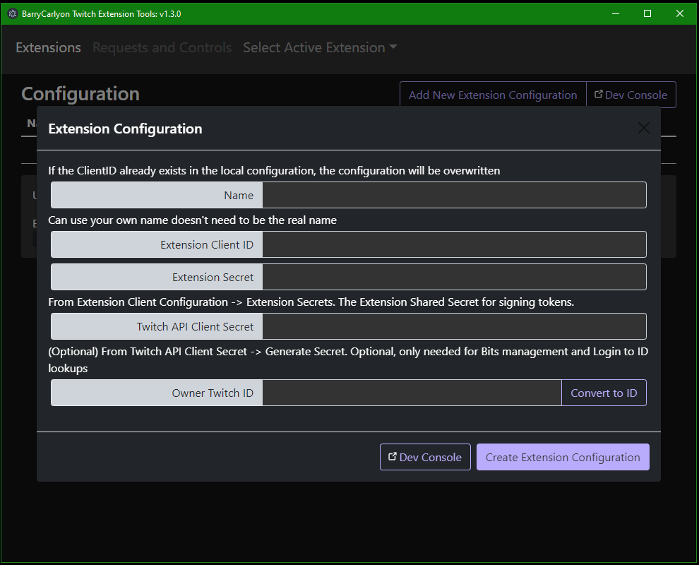

[](https://github.com/BarryCarlyon/twitch_extension_tools/actions/workflows/codeql-analysis.yml)

# What is this

This Program is an alternative version of the [Twitch Developer Rig](https://dev.twitch.tv/docs/extensions/rig).

Primarilly this works as a glorified Rest Client but handles the required [JWT generation](https://dev.twitch.tv/docs/extensions/building/#signing-the-jwt) or [App Access Token](https://dev.twitch.tv/docs/authentication/getting-tokens-oauth#oauth-client-credentials-flow) generation and maintance as needed.

Generally it should serve as a "test tool" and not used to manage a live extension, but you could, saves you writing your own Bits Product, or Extension Config Managment tool! *If you do so it's at your own risk*!



Check out [more Screenshots](https://github.com/BarryCarlyon/twitch_extension_tools/tree/main/screenshots)

## Installation and Updates

This is an Electron App, so it maybe installed from the GitHub [releases tab](https://github.com/BarryCarlyon/twitch_extension_tools/releases).

The Windows Build is Code Signed with the Publisher `Barry Carlyon`
The Mac Builds are Code Signed with Apple Cerficates that identify `Barry Carlyon`

You can download the latest version, for Windows and Mac from here on GitHub under [releases](https://github.com/BarryCarlyon/twitch_extension_tools/releases). These builds will self update

Or

[](https://apps.apple.com/app/id1661327253)

This Mac App Store build will update from the App Store itself and may lag a little behind releases here.

Or

Install using [winget](https://learn.microsoft.com/en-us/windows/package-manager/winget/)

> winget install BarryCarlyon.BarryCarlyonExtensionTools

## Uninstallation

You can use Windows "Add and Remove Programs" to uninstall the program.

And on mac just throw it in the trash! :-P

You may need to manually remove data stored in the data/config storage location below.

## Data/Config Storage

Your Extensions Client IDs and secrets are stored locally unencrypted in the file `config.json` in the following location:

Windows:

```
%appdata%/BarryCarlyonTwitchExtensionTools/
```

Mac DMG/Manual install:

```
~/Library/Application Support/BarryCarlyonTwitchExtensionTools/
```

Mac App Store

```
~/Library/Containers/com.barrycarlyon.twitch-extension-tools/Data/Library/Application\ Support/BarryCarlyonTwitchExtensionTools/
```

In the file `config.json`

Which follows the format:

```json
{
    "extensions": {
        ...
        "a_client_id": {
            "name": "Your Entered Name",
            "client_id": "",
            "extension_secret": "base 64 encoded secret",
            "user_id": "Twitch owner ID"
        },
        ...
        "a_client_id_with_secret": {
            "name": "Your Entered Name",
            "client_id": "",
            "extension_secret": "base 64 encoded secret",
            "client_secret": "a client API secret",
            "user_id": "Twitch owner ID",
            "access_token": "A recently generated App Access Token"
        }
        ...
    },
    "active": {
        "client_id": "Selected active Extension ClientID set to use",
        "version": "Selected Version to talk to"
    },
    "window": {
        "size": [ width, height ],
        "position": [ x, y ]
    }
}
```

⭐ Tip: If you open the Application and the window has gone missing, close the app, open `config.json` for editing and completely reset `"window"` to `{}` and then reopen the app, it'll reset to default display, top left. The App does _try_ to magically 0,0 the window if this happens but it might need a hand!

## Supported Features

We will use the [Get Extensions](https://dev.twitch.tv/docs/api/reference#get-extensions) API to see which features are enabled for your selected version of your extension and block/allow access in the UI as needed. Don't forget to turn on/off features (such as the Config Service of Chat Service) you'll need to use the Developer Console to do so.

- [Get Extension Configuration Segment](https://dev.twitch.tv/docs/api/reference#get-extension-configuration-segment)
- [Set Extension Configuration Segment](https://dev.twitch.tv/docs/api/reference#set-extension-configuration-segment)
- [Set Extension Required Configuration](https://dev.twitch.tv/docs/api/reference#set-extension-required-configuration)
- [Send Extension PubSub Message](https://dev.twitch.tv/docs/api/reference#send-extension-pubsub-message)
- [Send Extension Chat Message](https://dev.twitch.tv/docs/api/reference#send-extension-chat-message)
- [Get Extensions](https://dev.twitch.tv/docs/api/reference#get-extensions)
- Simulation of the Extension Details page for the selected version of an Extension
- Test different Versions of an Extension against the API.

If a Key Sets Extension API Client Secret is Provided, alllowing the generation of [client credentials](https://dev.twitch.tv/docs/authentication/getting-tokens-oauth#oauth-client-credentials-flow)
- Convert UserName to UserID for various endpoints via [Get Users](https://dev.twitch.tv/docs/api/reference#get-users)
- [Get Extension Bits Products](https://dev.twitch.tv/docs/api/reference#get-extension-bits-products)
- [Update Extension Bits Product](https://dev.twitch.tv/docs/api/reference#update-extension-bits-product)
- [Get Extension Transactions](https://dev.twitch.tv/docs/api/reference#get-extension-transactions)

## Common Gotchas/FAQ

Q. No matter what I do, it just claims authentication failed when trying to validate/refresh my Extension

A. Since the Extension API's _mostly_ utilise a JWT, this program creates a JWT on the fly with only a 4 second expiration. So if your system clock is _significantly_ out of date, this can generate an already expired JWT. So check your system clock is accurate.

## Not Supported Features

Extension View simulation, this might get explored but it's not gonna be as effective as actually testing on the Twitch Website itself (when in localtest).

Whilst the Twitch Developer Rig is now marked as no longer supported, view testing in the Rig remains working, but you may need another tool to update any Rig manifests you have stored, you can check out the [Twitch Developer Rig Manifester](https://github.com/BarryCarlyon/twitch_developerrig_manifester) to provide manifest import and revision. This manifester tool _might_ at somepoint get added to this tool.

## Notes

- Uses Electron to provide as a Desktop App
- Uses Bootstrap for primary layout
- Uses GitHub for update delivery and code management (and mac app store for MAS builds)
- JWT tokens are generated _inside_ the App via [auth0/node-jsonwebtoken](https://github.com/auth0/node-jsonwebtoken), as apposed to "ClientSide" like [this example](https://barrycarlyon.github.io/twitch_misc/examples/extension_config/)
- A number of [sindresorhus](https://github.com/sindresorhus/) Electron Modules.

## Insomnia?

Basically this app is a "save my Extension configs" Insomnia-esque Rest Client. That wraps the main Extension functions in a handy Application. With some extra features!

[Insomnia](https://insomnia.rest/) is a Rest client. I have written a Plugin for Insomnia to aid with JWT generating inside Insomnia itself. You can find that [here on Github](https://github.com/BarryCarlyon/insomnia-plugin-twitch-extension-barrycarlyon)

## Warranty

If you break your extension from using this tool it's your own fault and the author(s) accept no responsbility for problems caused to your extension from using this tool. Granted the worse thing you might do is deprecate a bits product you actually needed.....

## License

This project is Licensed under [Do What The F*ck You Want To Public License](https://github.com/BarryCarlyon/twitch_extension_tools/blob/main/LICENSE), so Just Do What the F*ck you want to!

## Development Notes

This is an [Electron Project](https://www.electronjs.org/)

To run locally, after cloning, just

```
$ npm install
$ npn run start
```

## Further Help with Twitch API

- [TwitchDev Documentation](http://dev.twitch.tv/docs)
- [TwitchDev Support Forums](https://discuss.dev.twitch.tv/)
- [TwitchDev Discord](https://link.twitch.tv/devchat)
- [TwitchDev Other Help](https://dev.twitch.tv/support)

[](https://link.twitch.tv/devchat)

## OMGLIEKWUT OHMYGOODNESS U SO MUCH HELP

Thank you for the help I want to give you beer/coffee money -> Check the Funding/Sponsor details
