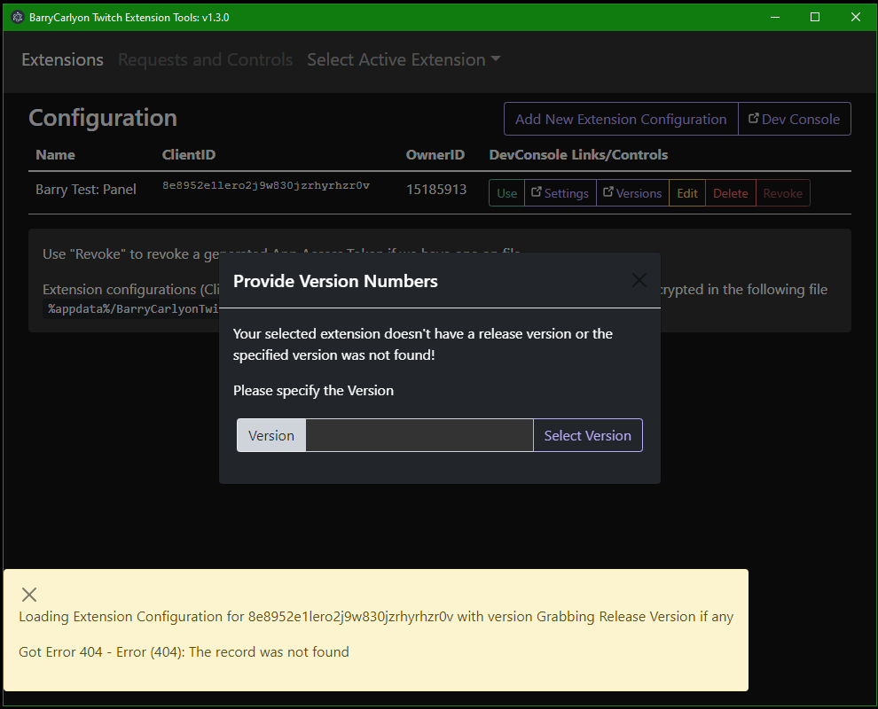
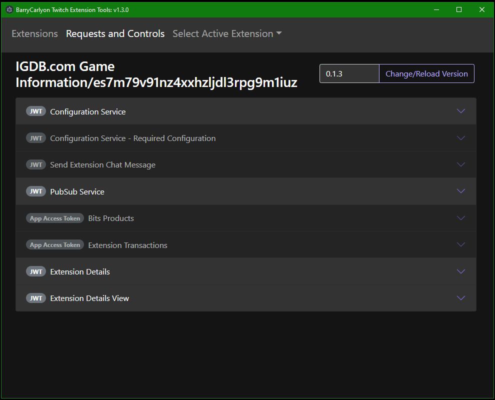

This is what you see when you First Launch the Application

This Extension has no release version so it instantly asks for a version number to go load information.

Using one of the Tools, it implements fields for each parameter of a API call

Using the Extension Details API, the Application checks for what functions are enabled for this version of the Extension and enables/disables access as needed.

Use `Change/Relaod Version` to reload the Manifest/enabled options.
